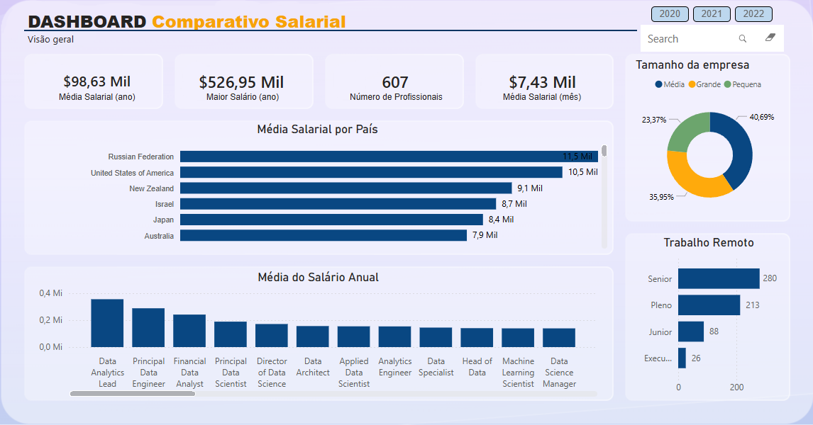
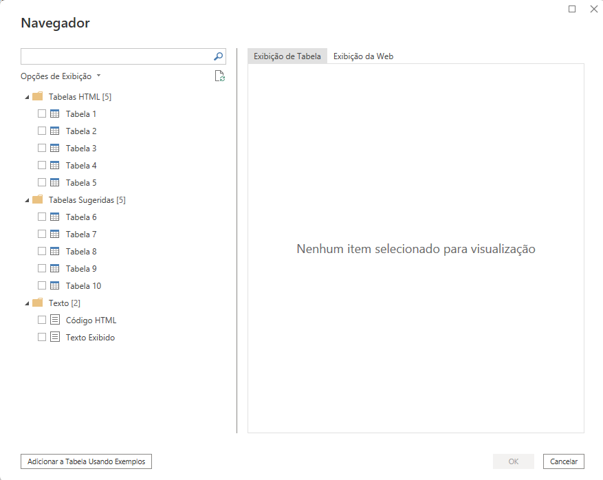
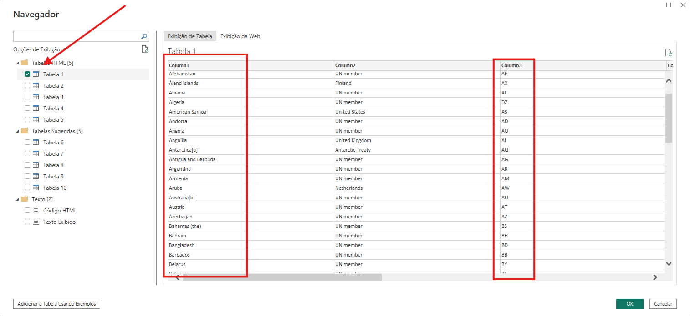
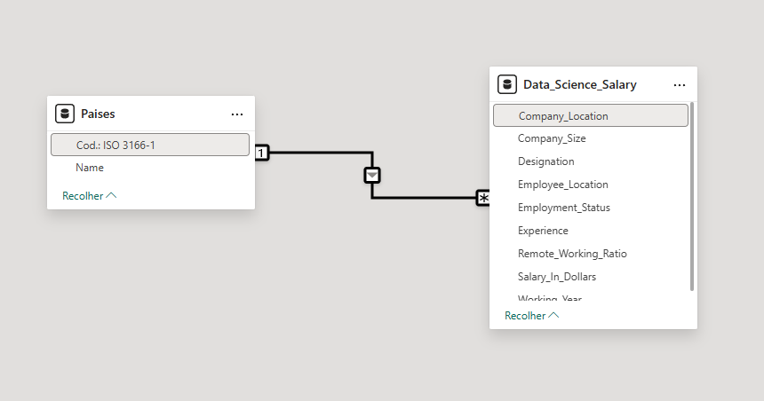

# 📊 Tratamento de Dados de Salários em Data Science

  

---

## 1. 📝 Introdução
Este projeto tem como objetivo realizar o processo de **ETL (Extração, Transformação e Carga)** em um dataset público do Kaggle contendo informações salariais na área de Ciência de Dados. O foco principal foi a limpeza, conversão monetária e melhoria da legibilidade das categorias de experiência para futuras análises em ferramentas de BI.

## 2. 💻 Tecnologias Utilizadas
* **Python:** Linguagem principal.
* **Pandas:** Manipulação e tratamento dos dados.
* **PandasQL:** Execução de queries SQL sobre DataFrames.
* **Jupyter Notebook / Google Colab:** Ambiente de desenvolvimento.

## 3. ⚙️ Processo de ETL Passo a Passo

### 3.1. 📥 Extração (Extract)
O dataset original foi carregado a partir do arquivo `Data_Science_Fields_Salary_Categorization.csv`.

* **Fonte:** Kaggle.
* **Formato:** CSV.

**Etapas de Inserção e Navegação Inicial:**

  
  

### 3.2. 🔄 Transformação (Transform)
Nesta etapa, aplicamos diversas transformações críticas para garantir a qualidade da análise e a correta formatação dos dados.

**Navegando e Explorando os Dados:**

  
  

**Passos Realizados:**

1. **Mantendo Apenas as Colunas Necessárias:** Selecionamos exclusivamente as colunas relevantes para a análise final, otimizando o dataset.
     
   
     

2. **Remoção de Nulos (NaN):** Identificação e tratamento de valores ausentes para evitar distorções nas métricas.
     
   
     

3. **Limpeza e Tipagem:** A coluna `Salary_In_Rupees` continha caracteres de texto (como vírgulas), que foram removidos para converter o campo corretamente em um tipo numérico (float).

4. **Conversão de Moeda:** Foi criada a coluna `Salary_In_Dollars` para converter os valores de Rúpias Indianas para Dólares Americanos, utilizando a taxa de câmbio definida no dia do projeto.
    * **Fórmula:** `Salário em Dólar = Salário em Rúpias / 90.60`

5. **Padronização de Senioridade:** Para facilitar a compreensão do usuário final no Dashboard, as siglas de experiência foram mapeadas para nomes descritivos:

| Sigla | Descrição (Senioridade) |
| :---: | :--- |
| **EN** | Junior |
| **MI** | Pleno |
| **SE** | Senior |
| **EX** | Executive |

**Modelagem e Estruturação Final:**

  

### 3.3. 📤 Carga (Load)
Após o tratamento, os dados limpos e transformados foram exportados para um novo arquivo, pronto para ser consumido por ferramentas como Power BI ou Tableau.

* **Arquivo Gerado:** `Data_Science_Salary.csv`

**Amostra do Resultado Final dos Dados:**

  

---

## 📌 Base de Dados Utilizada
🔗 [Data Science Fields Salary Categorization - Kaggle](https://www.kaggle.com/datasets/whenamancodes/data-science-fields-salary-categorization)

## 🎥 Demonstração do Projeto

